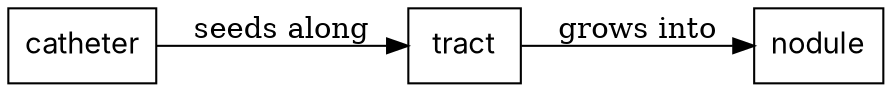

# Mode A Build Internals — python-pptx deck construction

Loaded on demand from `/present-paper` Phase 3 (see the trigger table under § Three Modes in
`SKILL.md`). Paths below are relative to the `present-paper` skill directory.

## Architecture

```
inline structured data (lists/dicts in build_*_slides())
    ↓ template functions (T_lead / T_text / T_table / ...)
editable PPTX with native text frames (selectable, restyleable in PowerPoint)
```

Three rules that keep slides stable:

1. **No markdown parsing.** Every slide is a function call with explicit inline data.
2. **No `cur_top` cumulative position tracking.** Use the fixed coordinate zones below — `cur_top` accumulates rounding errors and breaks layout after ~10 slides.
3. **No Marp.** Marp renders to images; the deck becomes uneditable and reviewers cannot copy text or restyle.

## Slide-type templates

| Template | Use for | Required fields |
|----------|---------|-----------------|
| `T_lead` | Title slide, section divider | `title`, `subtitle?`, `extra?` |
| `T_text` | Bullet body (most common) | `title`, `body_lines[]`, `subtitle?` |
| `T_table` | Cohort tables, comparisons | `title`, `headers[]`, `rows[][]`, `body_before?` |
| `T_image_right` | Body + figure on right | `title`, `body_lines[]`, `img_path`, `img_pct?` (PNG ≥300dpi or vector PDF — see Figure source formats below) |
| `T_quote_slide` | Verbatim citations, witness quotes | `title`, `quotes[]`, `body_after?`, `img_path?` |
| `T_two_col` | Compare/contrast | `title`, `left_lines[]`, `right_lines[]` |
| `T_two_col_with_box` | Compare + emphasis | as above + `metaphor_col`, `metaphor_lines[]` |
| `T_highlight_slide` | Single key result | `title`, `highlight_lines[]`, `body_before?` |
| `T_metaphor_body` | Body + analogy footer | `title`, `body_lines[]`, `metaphor_lines[]` |
| `T_table_two_col` | Take-aways + numeric table | `title`, `left_lines[]`, `headers[]`, `rows[][]` |

## Figure source formats (when consuming `/make-figures` output)

When the deck pulls figures from `analysis/figures/` produced by `/make-figures`:

- **Preferred for slides**: PNG at ≥300 dpi. python-pptx `add_picture()` handles this directly. Set `img_pct` (template `T_image_right`) so the figure occupies ≥40 % of slide width on a 13.33 × 7.5-in widescreen layout.
- **Vector source available**: prefer PDF only if the slide will be projected at >1080p or printed as a handout — convert PDF → PNG at the target DPI (`pdftoppm -r 300 input.pdf out_prefix`) before insertion, because python-pptx PDF embedding is unreliable across PowerPoint versions.
- **Forbidden**: TIFF (Mac PowerPoint silently drops it — see Mac compatibility checklist below); JPEG for line art (compression artifacts on diagonal lines); raw SVG (PowerPoint Mac handles it inconsistently).
- **Caption / legend**: re-draft for spoken-narration context, not the journal legend verbatim. The journal legend assumes a reader; the slide caption assumes a listener with 5–10 seconds of attention.
- **Put the claim in the slide, not in the raster.** A figure carries data; a conclusion drawn *into*
  the PNG ("Value = triage & safety net", a headline percentage) stops tracking the talk the moment
  the bullet above it is edited. Nothing catches that: text search sees the slide and not the image,
  so the only thing that finds it is a person looking at the render. Numbers and conclusions live in
  the slide's own text where they can be read, grepped, and corrected.
- **Generating an illustration instead of sourcing one**: allowed for concepts and scenes, never
  for anything that could be mistaken for a measurement — no generated CT, MRI, histology, or
  radiograph, not even "as an illustration". Read `references/generated_illustrations.md` before
  the first prompt; it also covers palette, text-in-image, provenance, and disclosure.

## Diagrams and plots are drawn as CODE, then inserted (not out of autoshapes)

**Hard rule. This is the highest-yield rule in the skill**, and it is the one thing practitioners
report actually working when they hand slide-making to an agent:

> "에이전틱하게 PPT 도구를 사용하거나 / 웹페이지 형식으로 구성하는 경우는 거의 100% 실패함. 그나마
> 성공률을 높일 방법은 다이어그램 / 플롯을 모두 잘 알려진 도구(matplotlib 등)를 활용해 '코드'로
> 그리도록 시킨 다음, 그 결과를 그대로 삽입하도록 지시하는 방법인 듯."

| Content | Draw it with | Never |
|---|---|---|
| Any chart | matplotlib / R (`/make-figures`) | Hand-placed shapes pretending to be a chart |
| Flow, mechanism, pipeline, hierarchy | matplotlib, or **Graphviz DOT** when the graph *is* the point | `python-pptx` autoshapes |
| Study flow (STROBE/PRISMA) | `/make-figures` flow builders | Boxes drawn one at a time |

Then insert the rendered PNG (≥300 dpi) with `add_picture()`.

**Check the rendered PNG before you insert it.** Drawing in code buys a second coordinate system,
and a stroke laid on the figure's boundary is half-cut by the render. On the slide that does not
read as a crop; it reads as a box with a side missing:

```bash
python3 scripts/check_diagram_edges.py diagrams/ --json qc/diagram_edges.json
```

`DIAGRAM_EDGE_CLIP` reports ink within a few pixels of the image border, and leaves full-bleed
images alone (a photograph has ink on all four edges by construction). Run it straight after
`savefig`, where the fix is an inner margin plus `bbox_inches="tight"` and a pad — once the PNG
exists the stroke is already half gone and cropping cannot bring it back. People find these one at
a time: the first time this guard ran it immediately found a second clipped diagram beside the one
a reader had noticed.

**Why the ban.** Building a diagram out of autoshapes produces both AI tells at once: a row of
identical rounded rectangles (`SHAPE_MONOTONY`) joined by arrows nobody labelled
(`ARROW_NO_SEMANTICS`). Graphviz makes the second one *structurally hard to get wrong* — a DOT edge
must be written `A -> B [label="seeds along"]`, so the language itself demands the arrow declare
what it claims:



An arrow is a claim — *causes, becomes, flows into, is compared with, predicts*. Six claims, one
glyph. Drawn unlabelled, every person in the room supplies a different verb, and one wrong arrow can
derail an entire discussion. See `references/ai_slide_tells.md` §4–5.

**The one exception**: a single, deliberate, labelled shape used as an accent (a callout box, a
highlight frame). One shape is a choice; eight identical ones are a generator.

## Helpers (used by templates — usually you do not call directly)

| Helper | Role |
|--------|------|
| `_text` | Single text box with `**bold**` inline markup |
| `_multiline` | Multi-line block with bullet (`- `, `✓ `) and `### subhead` support |
| `_title_block` | Title + teal underline + optional subtitle |
| `_table` | Styled table (teal header row, alternating rows) |
| `_quote` | Blockquote — teal left bar + light-blue background |
| `_highlight` | Yellow rounded box + orange 2pt border |
| `_metaphor` | Same shape as quote, lighter font |
| `_image` | PIL aspect-preserving image insert (handles iPhone EXIF if you transpose first) |
| `_slidenum` | Bottom-right page number |

## Design tokens (defaults — change to fit institution/journal)

```python
NAVY    = #1B2A4A   # title text, section divider background
TEAL    = #0072B2   # subtitle, underline, table header bg, quote bar
ORANGE  = #D55E00   # highlight box border
GRAY    = #333333   # body text
FONT    = 'Arial'   # present on both platforms; see the font-portability check below
```

## The font is a delivery decision, not a taste decision

A typeface that is not installed on the machine the deck opens on is substituted silently: the
words stay, the metrics change, line breaks move, and a box that fitted stops fitting. It is
invisible on the authoring machine by construction — you have the font — and it surfaces on the
projector.

```bash
python3 scripts/check_font_portability.py output/presentation.pptx --json qc/font_portability.json
```

`FONT_NOT_PORTABLE` names any typeface bundled with one operating system and absent on the other,
with a count per font so a 1,000-run body face reads differently from a stray monospace in three
code lines. It is a blocklist, not an allowlist: a hospital's licensed brand face is not this
check's business. It exempts fonts the deck **embeds**, and it treats a theme-level default as
inert until the deck actually contains text of the script that slot serves.
A pass does not verify font installation or renderer substitution. For the
Nature/Lancet builder, call `apply_fonts` after adding slides and before saving to
select installed Latin and East Asian faces without changing text or formatting.
It does not embed fonts or modify fonts inside images, tables or charts. Verify
the actual exported PDF's fonts as well as its visible layout.

Two ways to be safe, and both have a cost worth knowing:

- **Embed the fonts** (PowerPoint: Save > Embed fonts in the file). Licence permitting.
- **Carry a PDF.** The portable fallback — but **PDF drops embedded video**, so a deck with a clip
  must ship its MP4s separately or the fallback is not one.

## Fixed coordinate zones (16:9 = 13.333" × 7.5")

```
ML / MR = 0.8"     MT = 0.5"     CW = SW − ML − MR = 11.733"

TITLE_Y = 0.5"    TITLE_H = 0.8"
SUB_Y   = 1.3"    SUB_H   = 0.5"
BODY_Y  ≈ 1.9"    BODY_H  ≈ 5.1"
```

## Build script responsibilities

A from-scratch generation script must:

- **Reference every input by a path relative to the presentation directory, and keep every input
  that produced an artifact inside it.** A build script written during a session tends to point at
  wherever the work happened to be — a session scratch directory, a temp path. That directory is
  gone next week, and with it the ability to rebuild: the figure PNGs survive, the scripts that drew
  them do not, and a label baked into a figure can no longer be corrected to match a body line that
  has since changed. Save the figure-generation scripts next to the deck, not next to the session.
- Assign all four placeholder coordinates together (see Step 3.7) — a partial assignment writes a
  shape with no area *and* hides it from every check.
- Convert TIFF images to PNG before `add_picture` (Mac PowerPoint silently drops TIFF).
- Apply EXIF transpose to iPhone photos before insertion.
- After inserting/removing slides, sync `docProps/app.xml` (`<Slides>`, `<Notes>`, `HeadingPairs`, `TitlesOfParts`) to the actual count, or PowerPoint Mac will raise a recovery dialog on open.
- If you copy `<a:srcRect>` from another deck, copy the values verbatim — they are 1/1000-percent (cap 100000), never EMU. A unit conversion bug here crops 99% of the image off-slide.
- Print slide count, notes count, file size, and editability check at the end.

## Forbidden in Mode A

- ❌ Marp CLI for PPTX (always image-rendered, uneditable).
- ❌ Markdown auto-parsing into slides (layout drifts on every regeneration).
- ❌ `cur_top` cumulative top tracking (accumulates rounding error).
- ❌ Direct iPhone photo insert without EXIF transpose (rotated 90° in PowerPoint).
- ❌ Using `python-pptx` from-scratch rebuild to *edit* an existing deck — see Patch over Rebuild below.

## Mac PowerPoint compatibility checklist

PowerPoint Mac is stricter than Windows / Keynote / LibreOffice on OOXML defects.
Verify before delivering any deck destined for a Mac viewer:

| Defect | Detect | Fix |
|---|---|---|
| **TIFF images** | `find ppt/media -iname '*.tif*'` | `sips -s format png in.tif --out out.png` + replace `.tif`→`.png` in `_rels/*.rels` |
| **`<a:sp3d>` in rPr** | `grep -l '<a:sp3d>' ppt/slides/*.xml` | Regex-strip the `<a:sp3d>...</a:sp3d>` block (renders as red outline only on Mac) |
| **`app.xml` count mismatch** | `<Slides>` value + `HeadingPairs` count + `TitlesOfParts` size vs actual slide files | Sync all four fields to real count |
| **`srcRect` corruption** | Any value > 100000 (1/1000-percent cap) | Compare with original deck; restore verbatim |

Validation must run on **PDF export AND Mac PowerPoint** — neither alone catches all four. PDF misses `sp3d` outlines and `srcRect` corruption.

## Patch over Rebuild — editing an existing PPTX

When the user supplies an existing deck and asks for surgical edits (textbox width, image
crop, font swap, sp3d removal), prefer **regex/sed patching of the unzipped XML** over
regenerating with `python-pptx`. From-scratch rebuild loses:

- `<a:srcRect>` image crops
- `<a:sp3d>` / `<a:scene3d>` (when intentional)
- Slide master / layout / theme details
- `app.xml` and `core.xml` metadata

```bash
unzip -q original.pptx -d /tmp/work
python3 -c "
import re; from pathlib import Path
p = Path('/tmp/work/ppt/slides/slide23.xml')
s = p.read_text()
s = s.replace('cx=\"9504720\"', 'cx=\"11200000\"')
p.write_text(s)
"
cd /tmp/work && zip -rq ../patched.pptx . -x '*.DS_Store'
```

`python-pptx` is reserved for (a) brand-new decks built via the templates above, or
(b) appending speaker notes via `slide.notes_slide.notes_text_frame.text`. The skill's
`scripts/inject_speaker_notes.py` is the canonical example of (b). It parses inline
`**bold**` / `*italic*` into run-level styling by default (python-pptx stores `text`
verbatim, so the markers would otherwise show literally in Presenter View — the failure
mode `pptx-speaker-notes.md` warns against); pass `--no-markdown` for legacy plain text.
A reproducible check lives at `tests/test_speaker_notes_markdown.py`.
